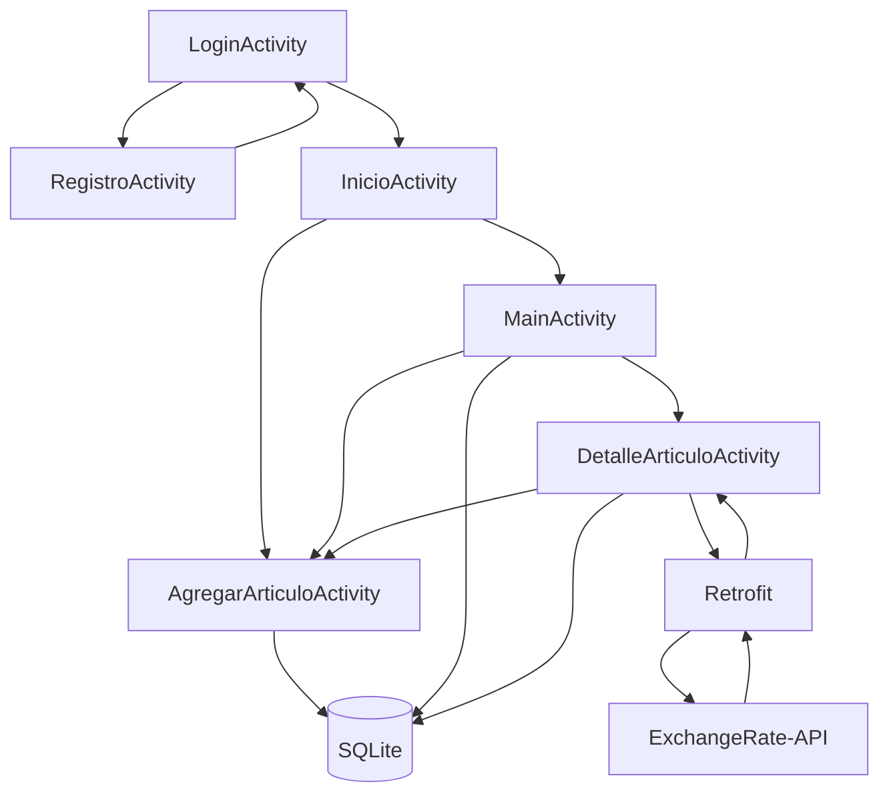

# MuebleriaApp — Mueblería "Quetzal"

Aplicación Android desarrollada en **Java** para la gestión local de un catálogo e inventario de muebles. Permite registrar usuarios, iniciar sesión, crear, consultar, buscar, editar y eliminar artículos, asociar fotografías y consultar mediante una API el tipo de cambio **USD → GTQ** para mostrar el precio aproximado de cada mueble en dólares.


## Funcionalidades principales

- Registro de usuarios.
- Inicio y cierre de sesión.
- Persistencia de sesión mediante `SharedPreferences`.
- Registro de muebles con nombre, precio, categoría, descripción y fotografía.
- Selección de imágenes desde la galería.
- Captura de fotografías utilizando la cámara del dispositivo.
- Almacenamiento local de artículos mediante **SQLite**.
- Listado de artículos mediante `RecyclerView`.
- Búsqueda por nombre o categoría, ignorando mayúsculas, minúsculas y tildes.
- Contador de resultados y estado visual para inventario vacío.
- Vista detallada de cada artículo.
- Edición y eliminación con confirmación.
- Conversión aproximada del precio de quetzales a dólares mediante **ExchangeRate-API**.
- Migración de artículos almacenados con el sistema anterior hacia SQLite.
- Interfaz basada en **Material Design**.

## API de tipo de cambio

La aplicación consume **ExchangeRate-API** mediante Retrofit para obtener el tipo de cambio actualizado tomando como moneda base el dólar estadounidense.

Endpoint utilizado:

```text
https://open.er-api.com/v6/latest/USD
```

La interfaz Retrofit se encuentra en `ExchangeRateApi.java`:

```java
@GET("v6/latest/USD")
Call<ExchangeRateResponse> obtenerTipoCambio();
```

La respuesta JSON se procesa mediante `ExchangeRateResponse`, donde el mapa `rates` contiene las tasas disponibles. La aplicación obtiene específicamente la tasa correspondiente a `GTQ`.

En la pantalla de detalle del artículo se utiliza la relación:

```text
precio en USD ≈ precio en GTQ / tasa GTQ por USD
```

Por ejemplo, si un mueble cuesta `Q 1,000.00` y la API devuelve una tasa de `1 USD = Q 7.65`, la aplicación muestra aproximadamente:

```text
Q 1000.00
≈ US$ 130.72
Tipo de cambio: 1 USD = Q 7.6500 · ExchangeRate-API
```

Si no existe conexión a Internet, la API no responde o la respuesta no contiene la tasa GTQ, el artículo continúa siendo accesible y la aplicación muestra **“Conversión no disponible”**. La consulta de la API no modifica el precio almacenado en SQLite.

### Clases relacionadas con la API

```text
ExchangeRateApi.java       → Define el endpoint.
ExchangeRateResponse.java  → Representa la respuesta recibida.
RetrofitClient.java        → Configura Retrofit y Gson.
DetalleArticuloActivity    → Consulta la tasa y convierte el precio.
```

Para acceder al servicio, el proyecto declara el permiso:

```xml
<uses-permission android:name="android.permission.INTERNET" />
```

## Base de datos SQLite

La base de datos local se llama:

```text
muebleria.db
```

Actualmente utiliza la versión `2` y contiene las tablas `articulos` y `usuarios`.

### Tabla `articulos`

| Campo | Tipo | Descripción |
|---|---|---|
| `_id` | INTEGER | Clave primaria autoincremental |
| `nombre` | TEXT | Nombre del mueble |
| `precio` | TEXT | Precio en quetzales |
| `descripcion` | TEXT | Descripción del artículo |
| `categoria` | TEXT | Categoría del mueble |
| `foto_uri` | TEXT | URI de la fotografía |

El CRUD se implementa mediante `SQLiteOpenHelper`, `ContentValues` y consultas parametrizadas.

### Tabla `usuarios`

| Campo | Tipo | Descripción |
|---|---|---|
| `_id` | INTEGER | Clave primaria autoincremental |
| `usuario` | TEXT | Nombre de usuario único |
| `password_hash` | TEXT | Hash de la contraseña |
| `password_salt` | TEXT | Salt utilizado para proteger la contraseña |

## Seguridad

### Contraseñas

Las contraseñas **no se almacenan en texto plano**.

La clase `SeguridadContrasena` utiliza:

- `PBKDF2WithHmacSHA256`;
- salt aleatorio de 16 bytes generado mediante `SecureRandom`;
- 120,000 iteraciones;
- hash derivado de 256 bits;
- comparación mediante `MessageDigest.isEqual()`.

Cada usuario posee su propio salt.

### Consultas SQLite

Las operaciones que reciben valores variables utilizan parámetros en lugar de concatenar directamente la entrada del usuario.

Ejemplo:

```java
db.delete(
    TABLA_ARTICULOS,
    COLUMNA_ID + " = ?",
    new String[]{String.valueOf(articulo.getId())}
);
```

### Validación de entradas

`ValidadorEntrada` procesa y valida los datos antes de almacenarlos:

- elimina caracteres de control;
- conserva caracteres legítimos como tildes y apóstrofes;
- limita la longitud de nombre, categoría y descripción;
- valida precios mediante `BigDecimal`;
- rechaza valores vacíos, negativos, iguales a cero o fuera del rango permitido.

### Almacenamiento anterior y migración

Versiones anteriores del proyecto almacenaban el inventario en JSON protegido mediante **AES-256-GCM** y **Android Keystore**.

La versión actual utiliza **SQLite como almacenamiento principal de los artículos**, pero conserva temporalmente las clases `DatosApp` y `AlmacenamientoSeguro` para poder leer y migrar datos creados con el sistema anterior.

Durante la migración:

1. se recuperan los artículos antiguos;
2. los registros sin ID de SQLite se insertan en `muebleria.db`;
3. posteriormente el inventario se carga desde SQLite.

Este mecanismo es transitorio y puede eliminarse en una versión futura cuando ya no sea necesario mantener compatibilidad con instalaciones antiguas.

## Tecnologías

| Componente | Uso |
|---|---|
| Java 11 | Lógica de la aplicación |
| Android SDK 36 | Plataforma Android |
| Material Components | Interfaz de usuario |
| RecyclerView | Presentación del catálogo |
| SQLite / SQLiteOpenHelper | Persistencia local |
| SharedPreferences | Estado de la sesión |
| PBKDF2WithHmacSHA256 | Protección de contraseñas |
| Retrofit 2.11.0 | Cliente HTTP para la API |
| Gson Converter 2.11.0 | Conversión de JSON |
| ExchangeRate-API | Tipo de cambio USD/GTQ |
| FileProvider | Acceso controlado a fotografías |
| AES-256-GCM / Android Keystore | Compatibilidad con almacenamiento cifrado anterior |

## Requisitos

- Android Studio compatible con el proyecto.
- Android SDK 36 instalado.
- Java 11 compatible con la configuración de Gradle.
- Dispositivo o emulador con **Android 8.0 (API 26)** o posterior.
- Conexión a Internet para consultar el tipo de cambio.
- La cámara es opcional; también se pueden seleccionar fotografías desde la galería.

## Instalación y ejecución

1. Clona o descarga el repositorio.
2. Abre Android Studio.
3. Selecciona **Open**.
4. Abre la carpeta raíz de `MuebleriaApp`.
5. Espera a que finalice **Gradle Sync**.
6. Selecciona un emulador o conecta un dispositivo Android.
7. Ejecuta el módulo `app`.

```bash
git clone URL_DE_TU_REPOSITORIO
cd MuebleriaApp
```

Sustituye `URL_DE_TU_REPOSITORIO` por la dirección real del repositorio.

## Flujo de uso

1. Al iniciar la aplicación se muestra `LoginActivity`.
2. Un usuario nuevo puede acceder a `RegistroActivity` y crear una cuenta.
3. Después de autenticarse se abre `InicioActivity`.
4. Desde la pantalla inicial se puede acceder al inventario o registrar un nuevo artículo.
5. El inventario muestra los muebles almacenados en SQLite.
6. El buscador permite filtrar por nombre o categoría.
7. Al seleccionar un artículo se abre `DetalleArticuloActivity`.
8. En el detalle se muestra el precio en quetzales y se consulta ExchangeRate-API para calcular su valor aproximado en dólares.
9. Desde esa misma pantalla el artículo puede editarse o eliminarse.

## Flujo simplificado



## Estructura principal

```text
app/src/main/
├── AndroidManifest.xml
├── java/com/example/muebleriaapp/
│   ├── LoginActivity.java
│   ├── RegistroActivity.java
│   ├── InicioActivity.java
│   ├── MainActivity.java
│   ├── AgregarArticuloActivity.java
│   ├── DetalleArticuloActivity.java
│   ├── Articulo.java
│   ├── ArticuloAdapter.java
│   ├── ArticuloDbHelper.java
│   ├── DatosApp.java
│   ├── ValidadorEntrada.java
│   ├── SeguridadContrasena.java
│   ├── SesionUsuario.java
│   ├── AlmacenamientoSeguro.java
│   ├── ExchangeRateApi.java
│   ├── ExchangeRateResponse.java
│   └── RetrofitClient.java
└── res/
    ├── drawable/
    ├── layout/
    ├── mipmap/
    ├── values/
    └── xml/
```

## Dependencias principales

```kotlin
implementation("androidx.recyclerview:recyclerview:1.4.0")

implementation("com.squareup.retrofit2:retrofit:2.11.0")
implementation("com.squareup.retrofit2:converter-gson:2.11.0")
```

## Pruebas recomendadas

- Registrar un usuario nuevo.
- Intentar registrar dos veces el mismo usuario.
- Comprobar el inicio de sesión con credenciales correctas e incorrectas.
- Crear, editar y eliminar muebles.
- Reiniciar la aplicación y comprobar la persistencia en SQLite.
- Buscar artículos por nombre y categoría.
- Buscar utilizando mayúsculas/minúsculas y palabras con tildes.
- Probar nombres y descripciones con caracteres válidos especiales.
- Probar campos vacíos y textos que superen los límites.
- Probar precios `0`, negativos, alfabéticos y fuera del rango permitido.
- Seleccionar una fotografía desde la galería.
- Tomar una fotografía con la cámara.
- Denegar el permiso de cámara y comprobar que la aplicación continúe funcionando.
- Abrir el detalle de un artículo con Internet y comprobar la conversión GTQ → USD.
- Desactivar Internet y comprobar que aparezca “Conversión no disponible” sin cerrar la aplicación.
- Verificar que el precio original almacenado en SQLite permanezca en quetzales.

## Privacidad y datos

Los artículos y usuarios se almacenan localmente en el dispositivo.

La aplicación consulta un servicio externo únicamente para obtener el tipo de cambio. El precio del artículo se utiliza localmente para realizar la conversión después de recibir la tasa GTQ.

Las copias de seguridad de la aplicación están desactivadas mediante:

```xml
android:allowBackup="false"
```

No deben agregarse al repositorio archivos locales o sensibles como:

```text
local.properties
*.jks
*.keystore
keystore.properties
```

## Limitaciones actuales

- No existe sincronización del inventario en la nube.
- Las cuentas de usuario son locales al dispositivo.
- No existe recuperación de contraseña.
- La sesión se mantiene localmente mediante `SharedPreferences`.
- La conversión a dólares requiere acceso a Internet.
- La tasa mostrada depende de la disponibilidad y datos proporcionados por ExchangeRate-API.
- Los precios principales del inventario continúan almacenándose en quetzales.
- Se conserva código de compatibilidad con el antiguo almacenamiento cifrado mientras finaliza la migración a SQLite.

## Posibles mejoras

- Eliminar el almacenamiento heredado cuando la migración a SQLite se considere finalizada.
- Separar usuarios y artículos mediante relaciones si se desea un inventario por cuenta.
- Incorporar Room como capa de persistencia.
- Agregar categorías predefinidas y filtros avanzados.
- Añadir ordenamiento por nombre, categoría y precio.
- Implementar caché del último tipo de cambio válido para funcionamiento sin conexión.
- Mostrar la fecha de actualización de la tasa.
- Incorporar pruebas unitarias e instrumentadas para SQLite, autenticación y consumo de API.
- Implementar un backend para sincronización entre dispositivos.

## Autor

**William Pereira**

Proyecto académico desarrollado como práctica de desarrollo de aplicaciones Android con Java, persistencia SQLite, seguridad local y consumo de servicios REST.
