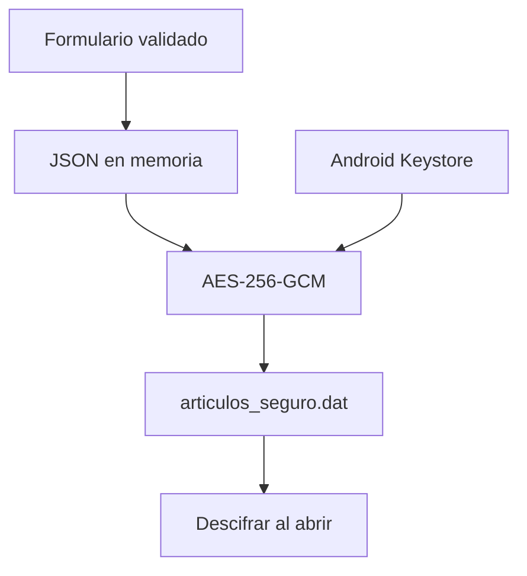

# MuebleriaApp

Aplicación Android para administrar un inventario local de muebles. Permite
registrar, consultar, buscar, editar y eliminar artículos, además de asociar
fotografías tomadas con la cámara o seleccionadas desde la galería.

El proyecto está desarrollado de forma nativa con **Java** y protege el
inventario mediante **AES-256-GCM** y **Android Keystore**.


## Funcionalidades

- Pantalla de inicio con acceso al inventario y al formulario de registro.
- Registro de muebles con nombre, precio, categoría y descripción.
- Selección de fotografías desde la galería.
- Captura de fotografías utilizando la cámara del dispositivo.
- Listado local de artículos.
- Búsqueda de artículos por nombre o categoría.
- Vista detallada de cada artículo.
- Edición y eliminación con confirmación.
- Persistencia local del inventario.
- Migración automática del antiguo archivo JSON al almacenamiento cifrado.
- Interfaz basada en Material Design.

## Seguridad implementada

### Validación de entradas

La clase `ValidadorEntrada` procesa los datos antes de guardarlos:

- elimina caracteres de control;
- conserva caracteres legítimos, como tildes y apóstrofes;
- limita nombre, categoría y descripción;
- valida precios con `BigDecimal`;
- rechaza precios vacíos, negativos, iguales a cero o fuera del rango permitido.

La aplicación actualmente no ejecuta consultas SQL. Si en el futuro se
incorpora SQLite o Room, las consultas deberán utilizar parámetros (`?` y
`selectionArgs`) o métodos DAO, sin concatenar la entrada del usuario.

### Cifrado del inventario

Los artículos no se conservan en un JSON legible. El contenido se cifra antes
de guardarse en `articulos_seguro.dat`:

- algoritmo `AES/GCM/NoPadding`;
- clave AES de 256 bits;
- clave generada y protegida por Android Keystore;
- vector de inicialización nuevo en cada operación de cifrado;
- autenticación GCM para detectar alteraciones del archivo;
- migración del antiguo `articulos.json` y eliminación posterior al cifrado
  exitoso.



El alias declarado en el código identifica la clave dentro de Android
Keystore; no contiene la clave real. Cada instalación genera su propia clave y
su propio archivo de inventario.

### Protección de registros y mensajes

- No se imprimen artículos, URI, claves ni excepciones mediante `Log`,
  `System.out` o `printStackTrace()`.
- Los mensajes `Toast` y `Snackbar` comunican únicamente resultados generales.
- No se muestran datos del inventario ni detalles técnicos en mensajes de error.
- Las copias de seguridad de la aplicación están desactivadas en el Manifest.

## Tecnologías

| Componente | Uso |
|---|---|
| Java 11 | Lógica de la aplicación |
| Android SDK | Plataforma nativa |
| Material Components | Interfaz y componentes visuales |
| ListView y ArrayAdapter | Presentación del inventario |
| JSON | Representación del inventario antes del cifrado |
| AES-256-GCM | Confidencialidad e integridad de los datos |
| Android Keystore | Protección de la clave de cifrado |
| FileProvider | Acceso controlado a fotografías de cámara |

## Requisitos

- Android Studio compatible con el proyecto.
- Runtime de Java incluido con Android Studio (recomendado) o un JDK compatible
  con la versión de Gradle; el código fuente utiliza compatibilidad Java 11.
- Android SDK instalado.
- Dispositivo o emulador con Android 8.0 (API 26) o posterior.

La cámara es opcional. La aplicación puede utilizarse en dispositivos sin
cámara mediante la selección de imágenes desde la galería.

## Instalación y ejecución

1. Clona o descarga este repositorio.
2. Abre Android Studio.
3. Selecciona **Open** y elige la carpeta raíz de `MuebleriaApp`.
4. Espera a que finalice **Gradle Sync**.
5. Selecciona un emulador o conecta un dispositivo Android.
6. Ejecuta el módulo `app`.

Para clonar el repositorio:

```bash
git clone URL_DE_TU_REPOSITORIO
cd MuebleriaApp
```

Sustituye `URL_DE_TU_REPOSITORIO` por la dirección de tu repositorio de GitHub.

## Uso

1. Desde la pantalla inicial, abre el inventario o registra un artículo.
2. Completa nombre, precio, categoría y descripción.
3. Opcionalmente, selecciona una imagen o toma una fotografía.
4. Presiona **Guardar artículo**.
5. Utiliza el buscador para filtrar por nombre o categoría.
6. Toca un artículo para consultar sus detalles, editarlo o eliminarlo.

## Estructura principal

```text
app/src/main/
├── AndroidManifest.xml
├── java/com/example/muebleriaapp/
│   ├── InicioActivity.java
│   ├── MainActivity.java
│   ├── AgregarArticuloActivity.java
│   ├── DetalleArticuloActivity.java
│   ├── Articulo.java
│   ├── ArticuloAdapter.java
│   ├── DatosApp.java
│   ├── ValidadorEntrada.java
│   └── AlmacenamientoSeguro.java
└── res/
    ├── drawable/
    ├── layout/
    ├── mipmap/
    ├── values/
    └── xml/
```

## Pruebas recomendadas

- Crear, editar y eliminar artículos.
- Reiniciar completamente la aplicación y confirmar la persistencia.
- Probar nombres con tildes y apóstrofes.
- Probar campos vacíos y textos que superen los límites.
- Probar precios `0`, negativos, alfabéticos y fuera del rango permitido.
- Confirmar en Device Explorer que existe `articulos_seguro.dat` y que no
  contiene información legible.
- Confirmar que `articulos.json` se elimina después de una migración exitosa.
- Revisar Logcat para comprobar que no aparecen datos del inventario.
- Denegar el permiso de cámara y verificar que la aplicación continúe estable.

## Privacidad de los datos

El inventario se guarda únicamente en el dispositivo. No se envía a servidores
ni se sincroniza con otras instalaciones. Al desinstalar la aplicación se
eliminan normalmente tanto el archivo local como la clave de Android Keystore,
por lo que los datos no podrán recuperarse sin un mecanismo de exportación
implementado expresamente.

No deben agregarse al repositorio archivos locales o sensibles como:

```text
articulos.json
articulos_seguro.dat
local.properties
*.jks
*.keystore
keystore.properties
```

## Limitaciones actuales

- No existe sincronización en la nube.
- No existe autenticación de usuarios.
- El inventario pertenece únicamente a la instalación local.
- No se incluye todavía una función de exportación o recuperación cifrada.
- No utiliza SQLite ni Room; la persistencia se basa en JSON cifrado.

## Posibles mejoras

- Incorporar Room con consultas parametrizadas.
- Agregar categorías predefinidas y filtros avanzados.
- Implementar exportación y respaldo cifrado controlado por el usuario.
- Incorporar pruebas instrumentadas de persistencia y migración.
- Mejorar la carga y compresión de fotografías.
- Añadir ordenamiento por nombre, categoría o precio.

## Autor

**William Pereira**

Proyecto académico desarrollado como práctica de programación segura de
aplicaciones Android con Java.
